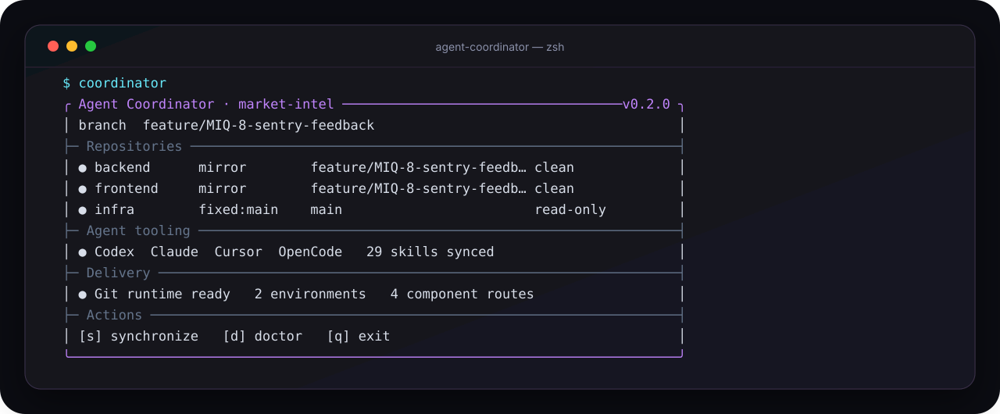

<p align="center">
  
</p>

<h1 align="center">Agent Coordinator</h1>

<p align="center">
  <strong>One declarative workspace for multi-repository Git, coding agents, portable skills, and GitHub Actions delivery.</strong>
</p>

<p align="center">
  <a href="#quick-start">Quick start</a> ·
  <a href="#one-manifest-many-outputs">Manifest</a> ·
  <a href="#transparent-multi-repository-git">Git</a> ·
  <a href="#repository-scoped-agents-and-portable-skills">Agents</a> ·
  <a href="#coordinated-cicd">CI/CD</a> ·
  <a href="#command-reference">Commands</a>
</p>

Agent Coordinator turns a coordinator repository and its Git submodules into one
intentional workspace. Describe each repository once in `coordinator.yaml`, then
let Git Coordinator read that manifest directly while rendering the project
agents expected by your coding tools, committed skills, and coordinated GitHub
Actions workflows.

> One manifest in. Tool-specific configuration out. Ordinary Git stays
> ordinary.

Agent Coordinator is currently an early-stage private CLI. Its core is
terminal-first: commands remain scriptable, while interactive setup and status
use a styled terminal interface built with
[Clack](https://bomb.sh/docs/clack/basics/getting-started/).

<p align="center">
  
</p>

## Why it exists

A product split across backend, frontend, infrastructure, and test repositories
usually accumulates several independent coordination layers:

- Git branches and gitlinks must agree.
- Coding tools need repository-specific agents and instructions.
- Skills need to be available without duplicating divergent copies.
- A delivery coordinator needs the exact child revisions represented by the
  root commit.

Agent Coordinator gives those layers one source of truth:

```text
coordinator.yaml
├── native Git + branch selection      → transparent multi-repository Git
├── optional local Compose             → one-file development orchestration
├── AGENTS.md + tool-specific agents   → repository ownership and delegation
├── .agents/skills + lockfile          → committed portable capabilities
└── GitHub Actions workflows           → gitlink-aware deployment dispatch
```

Gitlinks remain the authoritative version lock. Agent Coordinator does not
flatten repositories or erase their independent histories.

## Quick start

### Requirements

- Node.js 20.12 or newer
- Git
- [GitHub CLI](https://cli.github.com/) authenticated with `gh auth login` for
  the interactive repository picker and private release updates

The two coordinators have separate responsibilities. Agent Coordinator owns the
workspace model and generated adapters. Git Coordinator remains the external
runtime that safely coordinates ordinary Git commands. Agent Coordinator pins,
verifies, and installs a compatible engine version without modifying the
system Git binary.

### Install from the current checkout

The current development distribution is installed from source:

```sh
cd ~/Developer/agent-coordinator
npm install
npm run check
npm link
```

Verify the executable:

```sh
command -v coordinator
coordinator --version
```

With GitHub CLI configured as Git's credential helper, a direct global
installation from the private repository is also supported:

```sh
gh auth setup-git
npm install --global \
  git+https://github.com/fedecardinali/agent-coordinator.git#v0.2.1
```

### Install the transparent Git runtime

Install or refresh the compatible Git Coordinator runtime:

```sh
coordinator install
```

Agent Coordinator honors an engine explicitly selected through
`AGENT_COORDINATOR_GIT_COORDINATOR`. Otherwise it clones the pinned Git
Coordinator commit into an immutable cache under
`~/.local/share/agent-coordinator/git-engines`, verifies its origin, commit,
detached state, and clean tree, then installs the stable machine-wide runtime.
An unrelated `git-coordinator` found on `PATH` is not trusted as the installer
source. Automatic sibling-checkout discovery is disabled in production; the
development adapter enables it only through an explicit API option. An
unexpected or modified cache is left untouched and reported as an error.

### Initialize a workspace

Create an empty coordinator directory and launch the interactive flow:

```sh
mkdir -p ~/Developer/acme-coordinator
cd ~/Developer/acme-coordinator
coordinator init
```

The wizard:

1. Selects existing repositories from a GitHub user or organization.
2. Assigns a stable role id and branch policy to each repository.
3. Selects the coding tools that should receive project agents.
4. Optionally discovers committed skills from the selected repositories.
5. Initializes the root Git repository, adds submodules, writes the manifest,
   and synchronizes generated files.
6. Resolves or bootstraps the pinned Git runtime and installs the workspace Git
   integration, attaches policy-resolved child branches, and verifies the Git
   invariant, unless `--no-hooks` is selected.

Then inspect the workspace and commit the generated contract:

```sh
coordinator doctor
git add .
git commit -m "Initialize coordinated workspace"
```

`--no-hooks` is a configuration-only mode: it writes and validates the
   manifest and submodules without bootstrapping the
runtime, installing hooks, attaching branches, or running the runtime check.

For automation or a non-interactive terminal, declare repositories explicitly:

```sh
coordinator init ~/Developer/acme-coordinator \
  --name acme \
  --repo backend=acme/api,services/api \
  --repo frontend=acme/web,apps/web \
  --tools codex,claude \
  --discover-skills
```

Preview the initialization contract without writing anything:

```sh
coordinator init ~/Developer/acme-coordinator \
  --name acme \
  --repo backend=acme/api \
  --dry-run
```

## One manifest, many outputs

`coordinator.yaml` is project-owned after initialization. Generated files point
back to it and should not be edited by hand.

```yaml
schemaVersion: 2
name: market-intel
remote: origin

repositories:
  - id: backend
    path: services/backend
    url: git@github.com:acme/market-intel-api.git
    branch:
      mode: mirror
      readOnly: false
    agent:
      description: Owns the Market Intel API and its contracts.
      instructions:
        - Keep database migrations backward compatible.
      verify:
        - npm test
      skills:
        - source: .agents/skills/api-contracts

  - id: frontend
    path: apps/frontend
    url: git@github.com:acme/market-intel-web.git
    branch:
      mode: mirror
      readOnly: false
    agent:
      verify:
        - npm run check

  - id: infra
    path: infrastructure
    url: git@github.com:acme/market-intel-infra.git
    branch:
      mode: fixed
      name: main
      readOnly: true

workspace:
  baseBranch: main
  mirrorActiveInLinkedWorktrees: true
  selection:
    backend:
      branch: $coordinator
      mode: active
    frontend:
      branch: $coordinator
      mode: active
    infra:
      branch: main
      mode: pinned

local:
  compose:
    projectDirectory: services/backend
    files:
      - services/backend/compose.yaml
    override: |
      services:
        app:
          ports: !override
            - '${BACKEND_PORT:-4000}:3000'

agents:
  tools:
    - codex
    - claude
    - cursor
    - opencode
  maxParallel: 4
  skillCollision: namespace

deployments:
  tokenSecret: SUBREPO_ACTIONS_TOKEN
  environments:
    staging:
      githubEnvironment: staging
      allowedBranches:
        - main
        - "feature/*"
      components:
        backend:
          repository: backend
          workflow: deploy-staging.yml
          state:
            provider: workflow-runs
          dispatchInputs:
            environment: staging
        frontend:
          repository: frontend
          workflow: deploy-staging.yml
          state:
            provider: github-deployment
            environment: staging
          dispatchInputs:
            environment: staging
```

Run one command after changing the manifest:

```sh
coordinator sync
```

Or verify generated state without changing files:

```sh
coordinator sync --check
```

### Generated contract

| Area | Generated output |
|---|---|
| Shared agent guidance | `AGENTS.md` |
| Codex | `.codex/config.toml`, `.codex/agents/*.toml` |
| Claude Code | `.claude/CLAUDE.md`, `.claude/agents/*.md`, `.claude/commands/<workspace>/*.md` |
| Cursor | `.cursor/agents/*.md` |
| OpenCode | `.opencode/agents/*.md` |
| Portable skills | `.agents/skills/*`, `.coordinator/agents.lock.json` |
| Delivery | `.coordinator/runtime/deployment-plan.mjs`, `.github/workflows/coordinator-deploy-*.yml` |

Delivery files are generated only when the manifest declares `deployments`.
The planner embeds the normalized deployment configuration derived from
`coordinator.yaml`; no second deployment manifest is generated or edited.
Synchronization removes the obsolete `.coordinator/deployments.json` only
when its ownership marker proves that Agent Coordinator generated it, and
preserves an unmanaged file at that path.
Tool-specific files are generated only for tools listed under `agents.tools`
and while `agents.manage` is not `false`.

Git configuration is not generated: schema version 2 is consumed directly from
`coordinator.yaml`. Synchronization removes an obsolete `.git-coordinator.json`
only when its ownership marker proves that Agent Coordinator generated it and
the workspace is already attached to the YAML-native runtime; unmanaged legacy
files are preserved.

Agent Coordinator marks every managed destination. It refuses to overwrite an
unmanaged file unless it is explicitly adopted with `--force`.

## Transparent multi-repository Git

Git Coordinator reads `coordinator.yaml` directly. Once the runtime and
workspace integration are installed, commands from the coordinator root remain
familiar:

```sh
git add .
git commit -m "Implement feature"
git pull
git push
git checkout main
git checkout -b feature/new-work
git worktree add ../new-worktree
```

Git Coordinator applies the operation to writable children according to their
branch policies, updates root gitlinks, and delegates unrelated Git commands to
the real Git executable. Outside a configured workspace, Git behaves normally.

### Branch policies

| Policy | Behavior |
|---|---|
| `mirror` | The child uses the same branch name as the coordinator. Writable by default. |
| `fixed` | The child always uses one named branch. Read-only by default. |
| `map` | Exact coordinator branches map to different child branches, with an optional `mirror` or `fixed` fallback. |
| `readOnly: true` | The child must remain clean and at the configured revision; coordinated add, commit, and push skip it. |

A mapped repository can be declared directly in the manifest:

```yaml
branch:
  mode: map
  branches:
    main: main
    feature/payments: feature/api-payments
  fallback:
    mode: mirror
  readOnly: false
```

When `workspace` is present, its `selection` contains exactly one entry for
every repository. That selection is versioned with each coordinator branch:
`active` repositories participate in coordinated writes, while `pinned`
repositories stay read-only at their gitlink. `$coordinator` resolves to the
current coordinator branch. Legacy schema version 1 manifests with an external
`workspaceManifest` remain readable during migration.

Useful runtime commands are deliberately explicit:

```sh
coordinator git install   # ensure the pinned runtime, then install workspace integration
coordinator git attach    # resolve and attach child branches
coordinator git check     # validate the Git invariant
```

Cross-repository pushes cannot be atomic. Git Coordinator publishes writable
children before the root coordinator and reports partial progress if a later
remote rejects its push.

## Local Docker Compose

An optional `local.compose` block keeps the coordinator-specific Compose
override in the same manifest. Base files and the project directory are safe
workspace-relative paths; the override is a literal Compose document, so tags
such as `!override` and environment interpolation remain untouched.

Forward any Compose arguments after the command name:

```sh
coordinator compose config
coordinator compose up -d --build
coordinator compose logs -f app
coordinator compose down
```

The CLI writes the override to a private temporary file, invokes Docker with
the declared base files in order, and removes the temporary file even when
Docker fails. No standalone Compose override is generated or tracked.

## Repository-scoped agents and portable skills

Agent Coordinator prepares coding tools; it does not execute or schedule their
agents.

For each repository, the generated agent:

- Has an explicit repository path and role.
- Is instructed not to edit siblings or the coordinator root.
- Reads root guidance and the child repository's closer `AGENTS.md` when one
  exists.
- Receives repository-specific instructions and verification commands from the
  manifest.
- Cannot create nested agents in the generated contract.

The selected tool remains responsible for deciding when and how to use those
agents.

### Skills from committed child trees

Skills are materialized into the canonical `.agents/skills` registry from the
exact commit pinned by the coordinator's gitlink, not from an uncommitted
working-tree copy. Nested submodule gitlinks are followed recursively. Each
generated lock entry records its source repository, source path, pinned commit,
Git tree object, and content digest.

Interactive discovery recognizes committed skills under:

```text
.agents/skills/<skill-name>/SKILL.md
.agents/flows/<flow-name>/SKILL.md
```

When different repositories export different skills with the same name,
`skillCollision: namespace` prefixes the repository id. Set it to `error` to
require explicit unique names instead.

Synchronize only agent and skill outputs:

```sh
coordinator agents sync
```

Verify them without writing:

```sh
coordinator agents check
```

Generated copies are not editing targets. Change the source skill in its child
repository, commit it there, and synchronize again.

## Coordinated CI/CD

Agent Coordinator generates root GitHub Actions workflows that use coordinator
gitlinks as the desired child revisions. It does not replace the deployment
workflow owned by each child repository.

For each configured environment, the generated planner:

1. Uses the deployment contract embedded from `coordinator.yaml`.
2. Reads the exact child SHA from the coordinator commit's gitlink.
3. Observes the latest child state from either workflow runs or GitHub
   Deployments.
4. Skips a revision that is already successfully deployed.
5. Avoids duplicating an active run for the desired revision and blocks when a
   different revision is active.
6. Dispatches the configured child workflow when a new run is required.
7. Verifies that GitHub started the child run at the exact desired SHA.

Generate or verify delivery files with:

```sh
coordinator ci sync
coordinator ci check
```

The generated root workflow is manually dispatched with `workflow_dispatch`.
It requires:

- A repository secret whose name matches `deployments.tokenSecret` and whose
  token can inspect and dispatch the child repositories.
- A dispatchable workflow in every referenced child repository.
- The desired child commit to be the head of the branch resolved by that
  repository's `mirror`, `fixed`, or `map` policy.
- GitHub Environments matching the declared root and optional child deployment
  state.

Branch allow-list patterns use path-aware globs: `*` matches one branch-name
segment and `**` may span `/` separators.

The coordinator validates and triggers child runs; it does not wait for their
eventual completion, provision secrets, or deploy directly to a cloud provider.

## Status and health

Run the dashboard at any point:

```sh
coordinator
coordinator status
```

Without a subcommand, an interactive terminal also offers refresh, sync, and
doctor actions. In a non-interactive terminal it prints status and exits.

`coordinator doctor` validates the complete local contract:

- Supported Node.js and available Git
- GitHub CLI installation and authentication status
- Initialized child repositories
- Child revisions matching root gitlinks
- Native Git manifest compatibility and up-to-date agent, skill, and CI files
- Git Coordinator availability and invariants

```sh
coordinator doctor
```

GitHub CLI absence or missing authentication is reported as a warning. Broken
repository, generated-file, or Git-runtime invariants fail the command.

## Updates

Check the latest private GitHub release:

```sh
coordinator update
```

Apply it explicitly:

```sh
coordinator update --apply
```

Updates require an authenticated GitHub CLI configured for Git credentials.
Updating Agent Coordinator does not modify a workspace and does not update or
uninstall Git Coordinator. Run `coordinator sync --check` afterward to see
whether the new CLI would change generated outputs.

If no private release has been published yet, the command reports that no
release is available.

## Migrating an existing Git Coordinator workspace

Agent Coordinator understands `.git-coordinator.json` schema 1 and 2.
Migration is preview-first: without `--write`, the generated YAML is printed to
standard output.

```sh
cd ~/Developer/existing-coordinator
coordinator migrate
```

Write the manifest after reviewing it:

```sh
coordinator migrate --write
coordinator git install
coordinator migrate --write --adopt-git
coordinator sync
coordinator git attach
coordinator doctor
```

`--adopt-git` is deliberately granular: after the preview has been reviewed,
it removes the absorbed `.git-coordinator.json` and an external workspace
manifest only when that workspace selection was safely embedded. It never
grants permission to replace agent guides, skills, or CI files. Install the
YAML-native Git runtime after writing the YAML and before removing the legacy
adapter. A normal `coordinator sync` also preserves an owned adapter until that
runtime is active for the workspace.

Migration preserves the remote, repository paths, branch policies, and optional
versioned workspace selection. A valid schema version 1 workspace JSON is
embedded in schema version 2 YAML; an unreadable or incompatible pointer stays
as legacy schema version 1 instead of being discarded. Migration also detects
configured Codex, Claude, Cursor, and OpenCode directories when selecting
initial tools.

Migration does not infer deployment environments, agent instructions,
verification commands, skill exports, or custom mappings such as a
`qa-automation` role owning a `web-e2e` repository. It therefore writes
`agents.manage: false`: existing agent and skill files stay untouched while the
Git layer can be adopted safely.

After completing those mappings in `coordinator.yaml`, set
`agents.manage: true`, preview with `coordinator agents check --force` (exit 1
means generated changes are pending), and explicitly adopt only that surface
with `coordinator agents sync --force`. Future agent synchronizations no longer
need `--force`.

## Command reference

| Command | Purpose |
|---|---|
| `coordinator` | Initialize interactively when no manifest exists, or show status and interactive actions inside a workspace. |
| `coordinator init [directory]` | Initialize a workspace interactively or from `--repo` flags. Supports `--dry-run`, `--no-submodules`, `--no-hooks`, and `--force`. |
| `coordinator status` | Render the current workspace dashboard. |
| `coordinator doctor` | Validate tools, repositories, gitlinks, generated state, and Git runtime. |
| `coordinator sync` | Synchronize agents, skills, and optional CI/CD outputs; remove only an owned obsolete Git adapter. |
| `coordinator sync --check` | Exit non-zero when any generated output is stale. |
| `coordinator agents sync` | Materialize tool-specific agents and committed skills. |
| `coordinator agents check` | Check agent and skill outputs without writing. |
| `coordinator ci sync` | Generate configured delivery files. |
| `coordinator ci check` | Check delivery files without writing. |
| `coordinator git install` | Ensure the pinned machine runtime, then install Git Coordinator integration for the workspace. |
| `coordinator git attach` | Attach policy-resolved repository branches. |
| `coordinator git check` | Run the Git Coordinator invariant check. |
| `coordinator compose [args...]` | Run Docker Compose from `local.compose`, forwarding all remaining arguments. |
| `coordinator install` | Resolve or bootstrap the pinned Git Coordinator engine, then install its machine-wide runtime. |
| `coordinator update [--apply]` | Check or explicitly apply the latest private release. |
| `coordinator migrate [directory] [--write] [--adopt-git]` | Preview or write a manifest from legacy Git Coordinator configuration, optionally removing safely absorbed legacy files. |
| `coordinator demo` | Render deterministic sample status used by documentation assets. |

Global output flags work across commands:

```sh
coordinator --json status
coordinator --no-color doctor
```

`--json` is intended for scripts and CI. Errors use the same machine-readable
shape and a non-zero exit code.

## Safety model

Agent Coordinator is conservative around user-owned state:

- Mutating generators have a corresponding preview or check path.
- Unmanaged destinations are never silently overwritten.
- `--force` is an explicit adoption decision, not a default repair mechanism.
- Generated file paths reject workspace escapes and symlink ancestors; file
  publication uses unpredictable same-directory staging and atomic renames.
- Skill copies come from committed Git trees, so dirty source changes are never
  accidentally published as generated capabilities.
- Skill directories stage on the workspace filesystem before replacement, and
  their ownership lock is written atomically.
- Secret values never belong in `coordinator.yaml` or its lockfiles; only the
  GitHub secret name is stored.
- Git Coordinator remains a separate installation and update boundary.

## Non-goals

Agent Coordinator currently does **not**:

- Run agents, select models, schedule tasks, or maintain an agent queue.
- Create child GitHub repositories; initialization selects existing ones.
- Replace child CI pipelines or deploy directly to Railway, ECS, Vercel, or
  another platform.
- Provision GitHub secrets or environment protection rules.
- Make independent Git remotes behave like an atomic transaction.
- Replace Git Coordinator's transparent runtime or reinstall the system Git
  binary.
- Provide a desktop or web GUI. The current interface is a scriptable CLI with
  interactive terminal prompts and a rendered status dashboard.
- Rewrite workspaces automatically when the CLI itself is updated.

These boundaries keep the coordinator portable across Git hosts, coding tools,
and deployment platforms while leaving execution to the system that already
owns it.

## Development

Install dependencies and run the complete verification contract:

```sh
npm install
npm run check
```

Useful development commands:

```sh
npm run dev -- --help
npm run dev -- demo
npm run typecheck
npm test
npm run compile
```

The CLI combines [Commander](https://github.com/tj/commander.js) for the
scriptable command surface, [Clack](https://github.com/bombshell-dev/clack) for
interactive prompts, [Zod](https://zod.dev/) for the manifest contract, and
[VHS](https://github.com/charmbracelet/vhs) for reproducible terminal demos.

Regenerate the deterministic SVG dashboard from the actual CLI output:

```sh
npm run demo:asset
```

The terminal recording source lives at `docs/demo.tape`. With
[VHS](https://github.com/charmbracelet/vhs) installed, it can render an animated
demo from the same stable command:

```sh
vhs docs/demo.tape
```

### Releasing

The package version and tag are one contract. After `npm run check`, create and
push `v<package-version>`. The tag workflow verifies the complete suite, builds
the installable archive, and creates or refreshes the private GitHub release.
`coordinator update` installs that exact validated tag rather than a moving
branch.

### Repository layout

```text
src/core/        manifest validation, file planning, errors, commands
src/workspace/   initialization, synchronization, legacy migration
src/git/         pinned Git Coordinator bootstrap and compatibility adapter
src/agents/      project-agent renderers and committed skill materialization
src/ci/          embedded deployment runtime and GitHub Actions generation
src/status/      workspace inspection
src/doctor/      health checks
src/update/      private release checks and explicit updates
src/ui/          Clack prompts and deterministic dashboard rendering
templates/       generated deployment planner runtime
test/            current automated contracts
```

Keep core planning independent from terminal prompts. Tests that exercise Git,
repositories, remotes, or worktrees must use isolated temporary fixtures rather
than real projects.

## License

Private software. No open-source license is granted at this stage.
